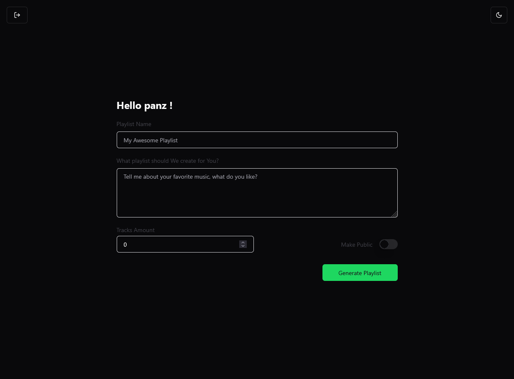
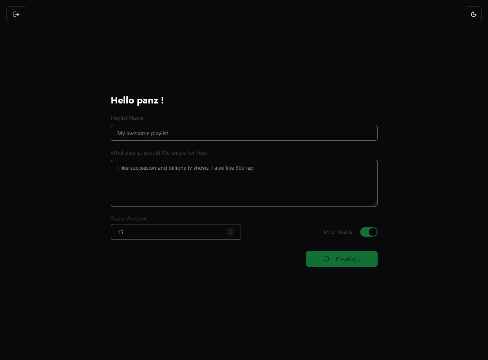
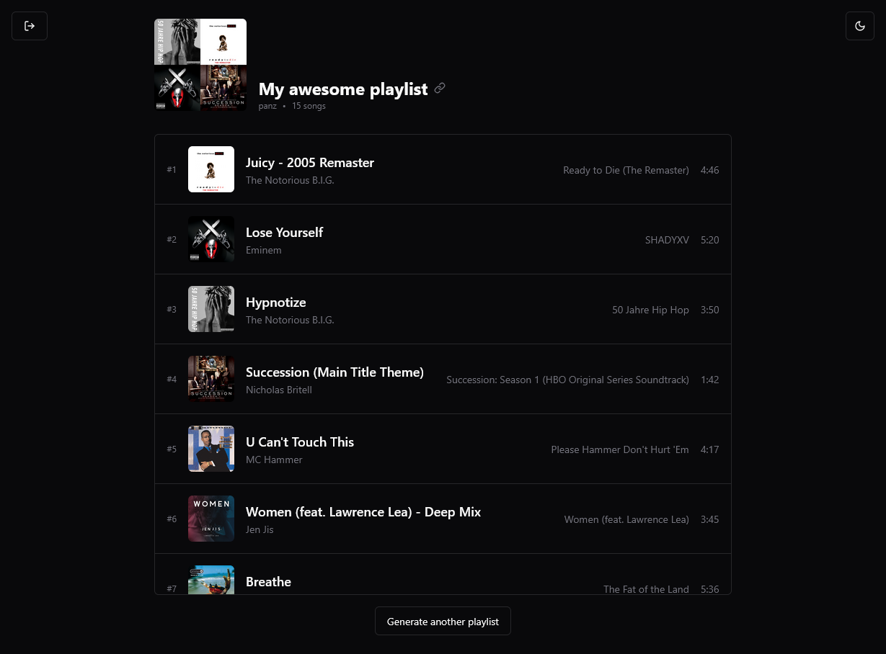

# AI Spotify playlist generator
A smart application that creates personalized Spotify playlists using Claude AI.
## Overview
This project combines the power of Claude AI with Spotify's API to generate custom playlists based on Your preferences. Connect Your Spotify account, specify Your music preferences, and let the AI create a perfect playlist for You.

## Tech stack

## How it works
### Connect to Spotify

### Generate new playlist

### Sample form

### Waiting for new playlist

### Your new playlist

